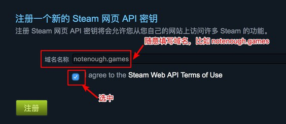
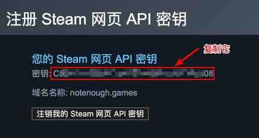

# 如何获取 Steam 网页 API 密钥

由于您的隐私设置默认被 Steam 设置为仅对好友可见，NotEnoughGames 默认无法访问您的游戏库。
同时，由于 Steam 的 API 有频次限制，若内置 API 密钥，NotEnoughGames 将无法正常工作。
我们建议您通过简单的几个步骤提供您的网页 API 密钥，以帮助我们正常的访问您的游戏库。

> 请参考我们的[隐私政策](privacy.md)以知悉我们如何保护您的隐私。

## 设置步骤

(1) 访问 Steam 网页版 API 设置页面： <https://steamcommunity.com/dev/apikey>

(2) 您将看到以下的界面：

在 **域名名称** 一栏写入任一个域名，例如：`notenough.games`。填写的内容如何并不影响 NotEnoughGames 工作，请随意填写。  
勾选 **I agree to the Steam Web API Terms of Use** 后点击 **注册** 按钮。

(3) 若填写无误，您将看到如下界面：

复制其中的 **密钥** 字段，回到 NotEnoughGames 中粘贴继续操作即可。

## 注意事项

* 请不要注销您的 Steam 网页 API 密钥，这将导致 NotEnoughGames 无法访问您的游戏库。
* 若您不想再继续使用 NotEnoughGames，请注销您的 Steam 网页 API 密钥。
* Steam API 密钥可以访问您的游戏列表、游戏时间和好友列表，并可以以您的身份访问您朋友的信息，请注意妥善保管。
同时留意请您我们的[隐私政策](privacy.md)以了解我们如何使用和保护您的数据。
